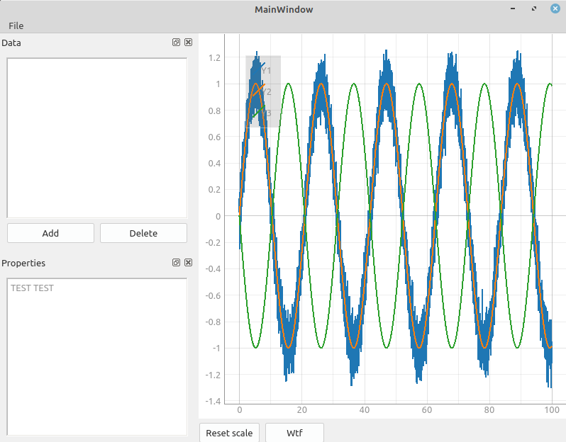

# justplot - simple data plotter with GUI

Just plot data from CSV and some other files with almost single
button quickly and easy without complicated GUI and lot of actions



## Features
Current status:
 - [X] Just plot the graph
 - [ ] Mathematical operations on data
 - [ ] Graph visual settings
 - [ ] Multiple graph panes
 - [ ] Graph export as image

Supported file types:
 - [x] CSV with space separator

## Installation

Note: this command will install package in Development Mode, i.e. it will reference local source

```sh
git clone https://github.com/Garrus007/justplot.git
pip3 install -e justplot
```

### Troubleshooting

Make sure all python dependencies are installed
```sh
# Ubuntu distro example
sudo apt install python3 python3-pip python3-setuptools
```

If PyQt5 failed to install try to install from repo
```sh
sudo apt install python3-pyqt5
```

## How to use
Run
```sh
jusplot
```
