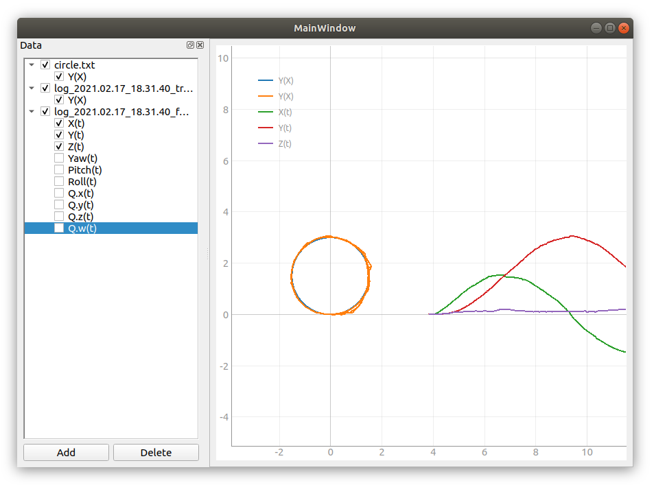

# justplot - simple data plotter with GUI

Just plot data from CSV and some other files with almost single
button quickly and easy without complicated GUI and lot of actions



## Features
Current status:
 - [X] Just plot the graph
 - [ ] Mathematical operations on data
 - [ ] Graph visual settings
 - [ ] Multiple graph panes
 - [ ] Graph export as image

Supported file types:
 - [x] CSV with space separator

## Installation

1. Clone or download repo
2. Install
```sh
pip3 install <path_to_repo>
```

## How to use
Run
```sh
jusplot
```
